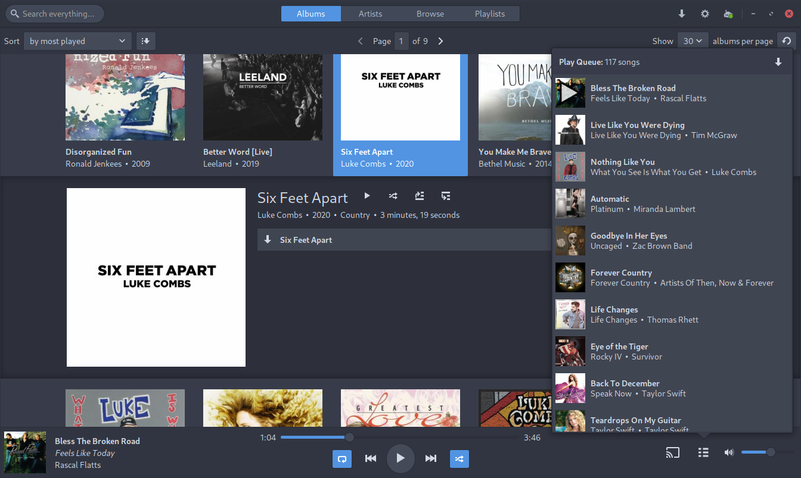

Welcome to Sublime Music's documentation!
=========================================

Sublime Music is a native, GTK3
`Subsonic`_/`Airsonic`_/`Revel`_/`Gonic`_/`Navidrome`_/\*sonic client for the
Linux Desktop.

.. _Subsonic: http://www.subsonic.org/pages/index.jsp
.. _Airsonic: https://airsonic.github.io/
.. _Revel: https://gitlab.com/robozman/revel
.. _Gonic: https://github.com/sentriz/gonic
.. _Navidrome: https://www.navidrome.org/

   The Albums tab of Sublime Music with the Play Queue opened. :doc:`More
   Screenshots <./screenshots>`

Features
--------

* Switch between multiple Subsonic-API-compliant [1]_ servers.
* Play music through Chromecast devices on the same LAN.
* Offline Mode where Sublime Music will not make any network requests.
* DBus MPRIS interface integration for controlling Sublime Music via clients
  such as ``playerctl``, ``i3status-rust``, KDE Connect, and many commonly used
  desktop environments.
* Browse songs by the sever-reported filesystem structure, or view them
  organized by ID3 tags in the Albums, Artists, and Playlists views.
* Intuitive play queue.
* Create/delete/edit playlists.
* Download songs for offline listening.

.. [1] Requires a server which implements the Subsonic API version 1.8.0+.

Installation
------------

**Via the AUR**:

Install the |AUR Package|_. Example using ``yay``::

    yay -S sublime-music

If you want support for storing passwords in the system keychain, also install
``python-keyring``.

If you want support for playing on Chromecast devices, install
``python-pychromecast``. If you want to serve cached files from your computer
over the LAN to Chromecast devices also install ``python-bottle``.

.. |AUR Package| replace:: ``sublime-music`` package
.. _AUR Package: https://aur.archlinux.org/packages/sublime-music/

**Via NixOS**:

Sublime Music is part of the ``nixos-20.09`` channel and newer (including
``nixos-unstable``).

To install Sublime Music on NixOS, either use the declarative or the imperative
way:

- In ``configuration.nix`` (declarative)::

    environment.systemPackages = [ pkgs.sublime-music ];

- In command line (imperative)::

    nix-env -iA sublime-music

To customize the extra components installed, you need to use the ``override``
function provided by Nix::

    (sublime-music.override {
      serverSupport = true;
      chromecastSupport = true;
    })

The following components are supported:

* ``chromecastSupport``: if you want support for playing on Chromecast devices
  on the LAN. Defaults to ``false``.
* ``serverSupport``: if you want to be able to serve cached files from your
  computer over the LAN to Chromecast devices. Defaults to ``false``.
* ``keyringSupport``: if you want to store your passwords in the system keyring
  instead of in plain-text. Defaults to ``true``.
* ``notifySupport``: if you want to enable notifications when a new song begins
  to play. Defaults to ``true``.
* ``networkSupport``: if you want to change the address used to access the
  server depending on what network you are connected to. Defaults to ``true``.

See `Nix package management`_ for more information.

.. _Nix package management: https://nixos.org/nixos/manual/index.html#sec-package-management

**Via the Debian package**

Sublime Music is not currently in the Debian 'Stable' distribution, but has been
packaged for Debian 'Unstable' and 'Testing'.

If you have these sources in your ``/etc/apt/sources.list``, you can install
the package with::

    sudo apt install sublime-music

**Via PyPi**::

    pip install sublime-music

There are a few optional dependencies that you can install. Here's an example of
how to do that::

    pip install sublime-music[keyring,chromecast,server]

* ``keyring``: if you want to store your passwords in the system keyring instead
  of in plain-text
* ``chromecast``: if you want support for playing on Chromecast devices on the
  LAN.
* ``server``: if you want to be able to serve cached files from your computer
  over the LAN to Chromecast devices

.. note::

   Sublime Music requires Python 3.8. Please make sure that you have that
   installed. You may also need to use ``pip3`` instead of ``pip`` if you are on
   an OS that hasn't deprecated Python 2 yet.

.. toctree::
   :numbered:
   :maxdepth: 1
   :caption: Contents:

   screenshots.rst
   settings.rst
   adapter-api.rst
   api/sublime.rst

Indices and tables
==================

* :ref:`genindex`
* :ref:`modindex`
* :ref:`search`
